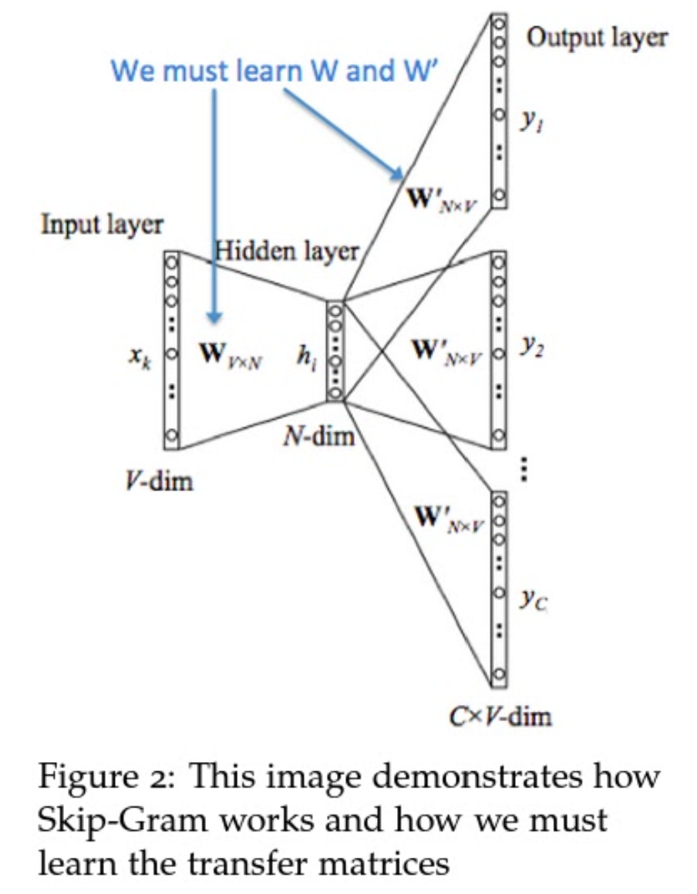
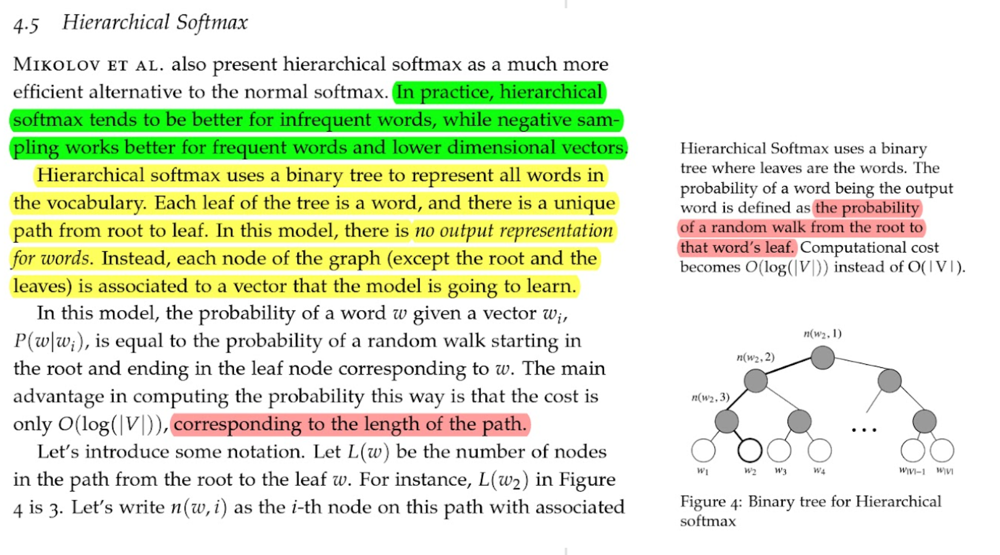
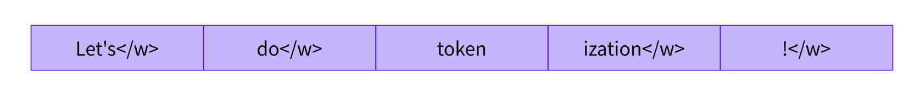
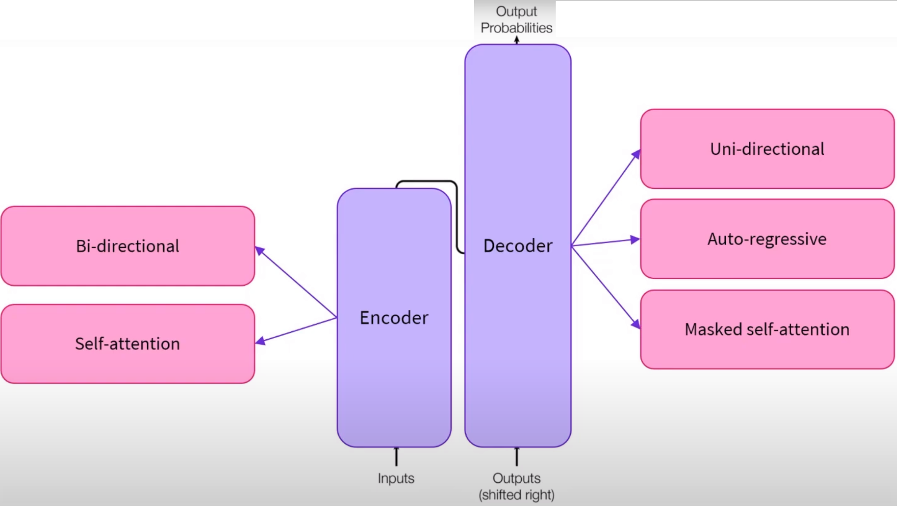
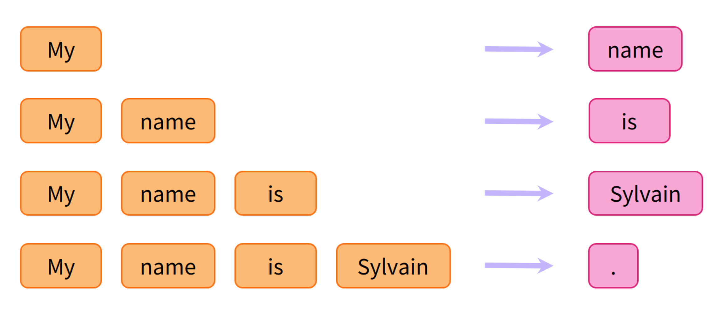
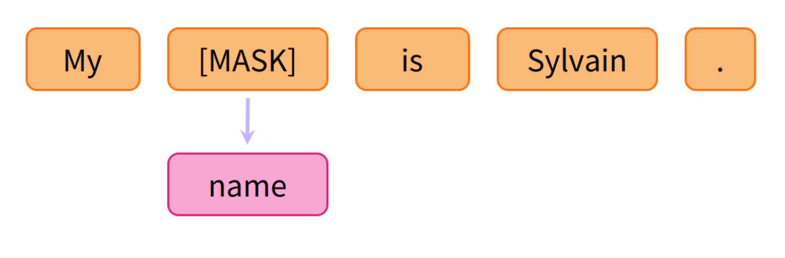
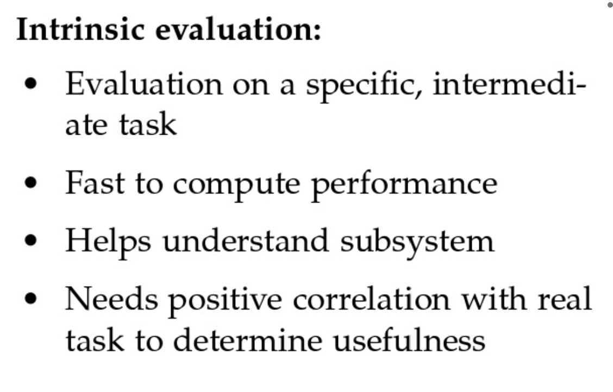
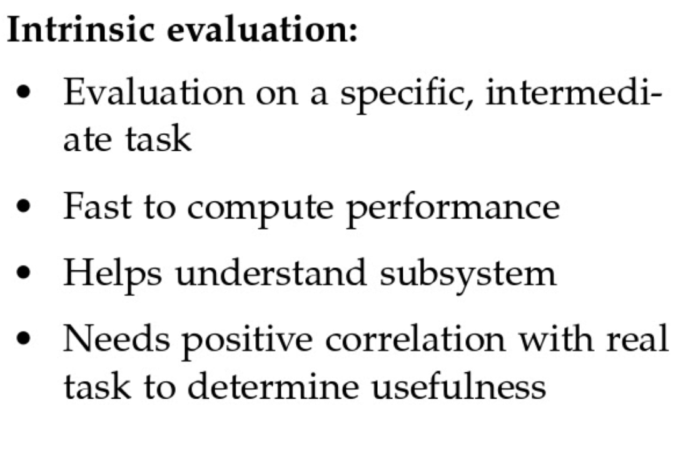

## Word Vector
- Skip Gram

   

- Good dimension (word vector length) is 300+-
- The Skip Gram and CBOW models are shallow window-based, which learn word embeddings by making predictions in local context windows. These models demonstrate the capacity to capture complex linguistic patterns beyond word similarity, but fail to make use of the **global co-occurrence statistics**.
- **Hierarchical Softmax, Negative Sampling**

   

## Tokenization
- Tokenizers take care of the first and last processing steps, handling the conversion from text to numerical inputs for the neural network, and the conversion back to text when it is needed. 
There are different tokenization approaches, such as 
  - word-based
  - character-based
  - subword-based 
  

   

## Sequence-to-sequence
- Encoder-decoder network / sequence-to-sequence model generates contextually appropriate, arbitrary length, output sequences
- Some fo the properties of seq-to-seq
  - many-to-many (Use Case: MT, summarization)
  - Weights are not necessarily shared across the encoder and decoder
  - Input distribution different from output distribution

## GPT-*
- Gpt2 is not released to the public due to ethical concern
  - Note: On GPT2 when he is changed to she, the descriptives change to adjectives that focusing on physical appearance. Hhence OpenAI advice that gpt2 should be avoided to interact with human
    - He was very 
      - personable 
      - large
      - lazy 
      - fantastic
    - She was very 
      - beautiful
      - gorgeous
      - naughty
      - bubbly

## Attention, Transformer
- Transformer is based on attention, but not recurring element
- Self-attention is an attention mechanism relating to different positions of a single sequence in order to compute a representation of the sequence 

   

   

## Language Model 
- What is language model?
  - All the Transformer models mentioned above (GPT, BERT, BART, T5, etc.) have been trained as language models. This means they have been trained on large amounts of raw text in a self-supervised fashion.
  - This type of model develops a statistical understanding of the language it has been trained on, but it’s not very useful for specific practical tasks. Because of this, the general pretrained model then goes through a process called transfer learning. During this process, the model is fine-tuned in a supervised way — that is, using human-annotated labels — on a given task.

- A language model usually does not need labels for its pretraining.
  - The pretraining is usually _self-supervised_, which means the labels are created automatically from the inputs (like predicting the next word or filling in some masked words.) 
  - Predict the next word model is a causal language model. 

- Causal Language Modelling
  

   

- Masked Language Modelling
  

   

### Evaluation

   

   

