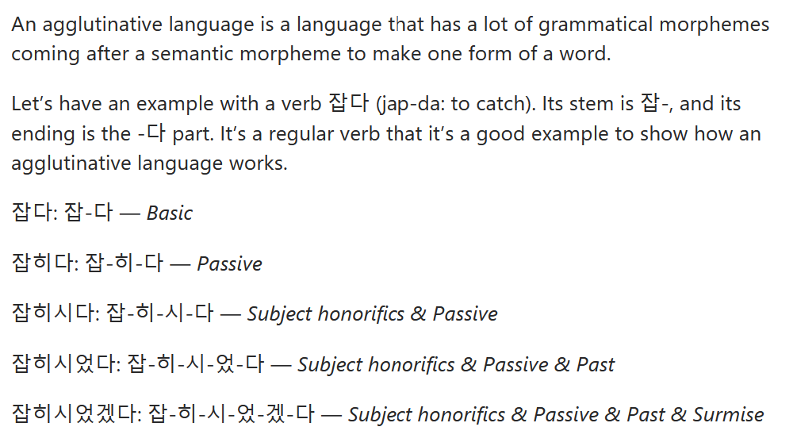

Every domain has it's commonly used terms/phrases.  
Below is an non-exhaustive list covering important keywords in Natural Language Processing (NLP). 

## General
- corpus
- word embedding/word vector/word representation
- contextual word representations
- one-hot encoding
- stopwords
- Out of Vocabulary (OOV)
- attention
- language model/modelling (LM)
- downstream task
- negative sampling
- hierarchical softmax
- auto-regressive model
- auto-encoding
- lexical-database
- self-supervised learning
- causal language model
- sequence-to-sequence (seq-to-seq)
- encoder-decoder network
- context vector
- extrinsic<>instrinsic evaluation
- tokenizer/tokenization
- window-based neural model
- domain mismatch
- agglutinative language 
- prefix 
- suffix
- parallel text/**bitext**
- wordnet

## Algorithm

- WordPiece
- SentencePiece
- Skip Gram
- Continuous Bag of Words
- Byte-Pair Encoding
- Term Frequency — Inverse Document Frequency (TF-IDF)
- Global Vectors for Word Representation (GloVE)
- Skip Grams
- Continuous Bag of Words (CBOW)
- N-Grams
- Recurrent Neural Network (RNN), Long Short Term Memory (LSTM)
- Embeddings from Language Models (ELMo)
- BERT
- BART
- TF5
- GPT-<numerical value> Example: GPT-3
  
## Evaluation 
- BLEU (Bilingual Evaluation Understudy) Score
  - The BLEU score provides an overall assessment of model quality
  - In translation, indicates how similar the candidate text is to the reference texts, with values closer to **one** representing more similar texts.
  
  
## Use Cases
  
### Classification
- Document Classification
- Sentiment Analysis
- Spam Filtering
- Dialog Classification
  
### Seq-to-seq
- Text Summarization
- Question Answering
- Machine Translation
- Text-to-Speech(TTS) Generation
- Dialogue Modelling
  
### Others
- Phase/Sentence Similarity
- Named Entity Recognition (NER)
- Dependency Parsing
- Part of Speech (POS) Tagging
- Masked Language Modelling
- Zero Shot Classification
- Text Generation  
- Speech Synthesis

  
## Huggingface Specific
- state dictionary

## Notes 
- **Dialogue Modelling** is a use case about the designing of formal system that reproduce aspects of natural conversation
- An **autoregressive model** predicts future values based on past values. Seq-to-seq / Encoder-decoder model is an autoregressive model.
- **Language modeling (LM)** is the use of various statistical and probabilistic techniques to determine the probability of a given sequence of words occurring in a sentence
- **Agglutinative Language**

   

- **Wordnet** is a lexical database of semantic relations between words in more than 200 languages. Links words into semantic relations including synonyms, hyponyms, and meronyms.
  - The meaning of "lexical" relate to the words or vocabulary of a language. Such as: lexical database
- The resources used to train machine translation systems are known as **parallel texts**, or **bitexts**. These are large text collections consisting of pair of sentences from different languages that are translation of one another. 
- **Skip Gram** predict context words from center of word
- **Zero Shot Classification** provide probability score for any list of labels with the data provided without training
- **State dictionary** of Hugging Face contains model weights/parameters, often stored in *.bin
